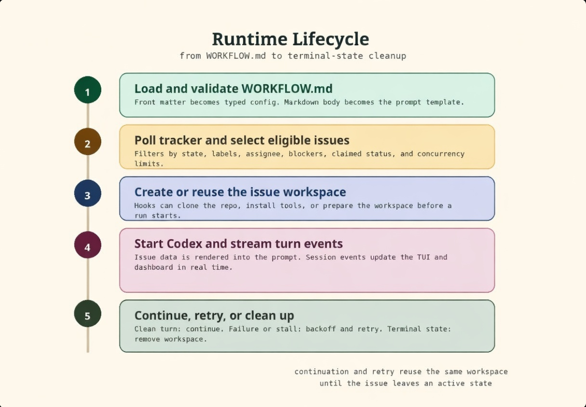
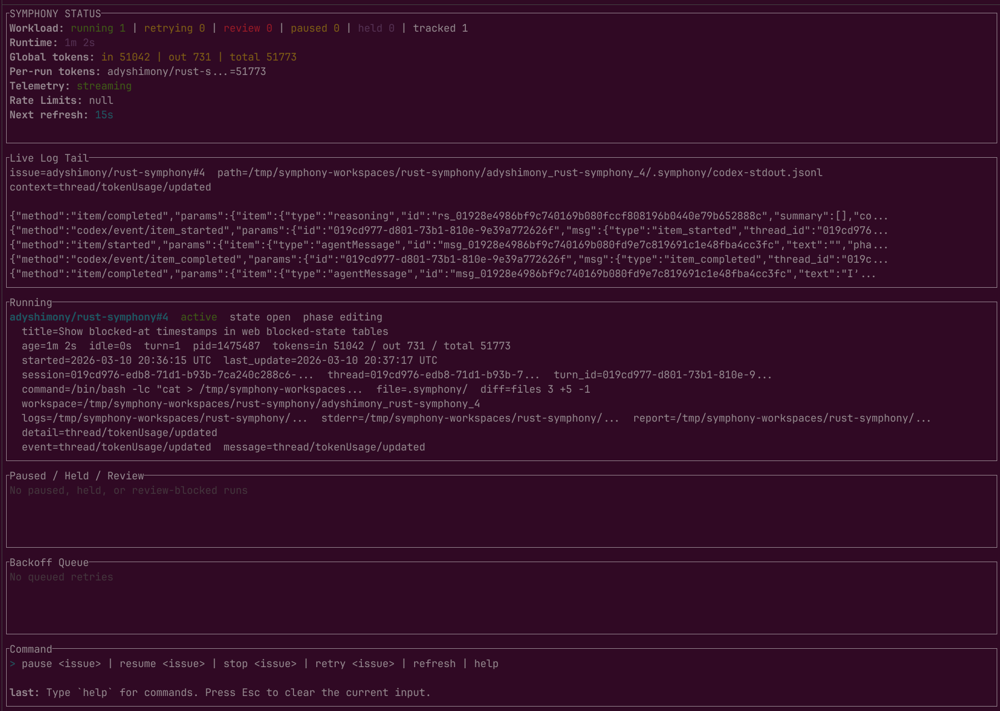
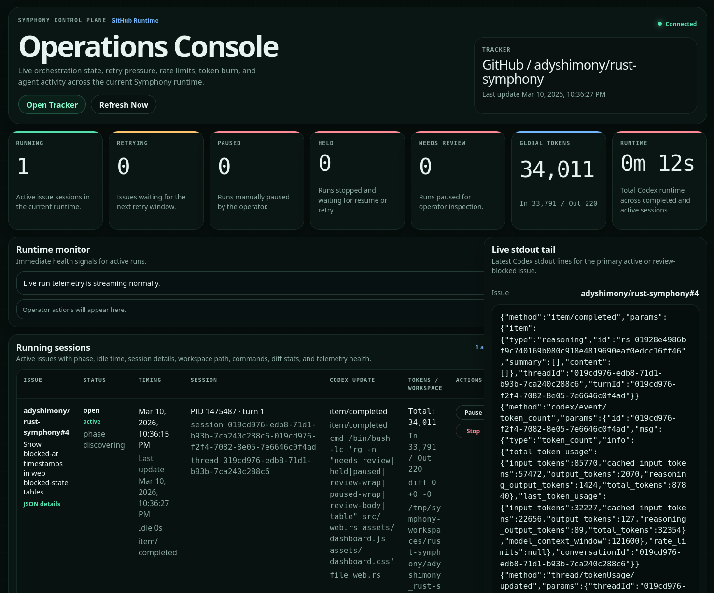

# Symphony Rust

Rust-first Symphony runtime for issue-driven coding-agent orchestration.

Symphony Rust watches a tracker, claims eligible issues, creates one workspace per issue, launches
`codex app-server` inside each workspace, and keeps the run moving until the issue is no longer in
an active state. It ships with a terminal TUI and an optional web dashboard so you can operate the
system from one process instead of manually supervising a pile of agent sessions.


> [!WARNING]
> This is engineering-preview software for trusted environments.
> The runtime requires an explicit acknowledgement flag in real mode and auto-accepts in-session
> approval requests from Codex. Treat it as high-trust orchestration, not a hardened sandbox.

## Why This Repo Exists

This repository is the standalone Rust implementation of Symphony.

For the original project context and earlier mixed-language work, see:

- [Original Symphony repository](https://github.com/openai/symphony)
- [Original language-agnostic spec](https://github.com/openai/symphony/blob/main/SPEC.md)
- [Original Elixir/OTP implementation](https://github.com/openai/symphony/tree/main/elixir)

Those links are reference material only. This repo does not depend on the old mixed-language layout.

## What Symphony Rust Does

- Polls GitHub Issues or Linear on a fixed cadence
- Filters work by active state, assignee, labels, and dependency status
- Creates and reuses isolated per-issue workspaces
- Runs configurable workspace hooks such as `git clone ... .`
- Starts Codex in app-server mode inside each workspace
- Runs a discovery-first turn before broader autonomous execution
- Renders a prompt from `WORKFLOW.md` front matter plus a Markdown body
- Tracks live session state, token usage, retry backoff, runtime totals, last command, last file,
  diff stats, and per-issue log paths
- Persists raw Codex stdout/stderr plus discovery/progress reports under `.symphony/`
- Maintains shared repository memory across issue runs
- Exposes operator controls for pause, resume, stop, retry, refresh, and review/resume flow
- Moves risky or oversized runs into `needs_review` instead of chewing forever
- Cleans up workspaces automatically when issues move to terminal states

## Quick Start

### 1. Run the built-in demo

Use demo mode when you want to inspect the TUI and dashboard without wiring a tracker first.

```bash
cargo run -- --demo --port 4000
```

What you get:

- TUI in your terminal
- Demo orchestration state with active runs and retry entries
- Optional dashboard at `http://127.0.0.1:4000/`

Press `q` or `Ctrl-C` to leave the TUI.

### 2. Run against a real tracker

Export a GitHub token first if you are using GitHub Issues:

```bash
export GITHUB_TOKEN="$(gh auth token)"
```

```bash
cargo run -- \
  --i-understand-that-this-will-be-running-without-the-usual-guardrails \
  --port 4000 \
  ./WORKFLOW.md
```

Useful flags:

- `--demo`: force the built-in demo runtime
- `--logs-root <PATH>`: write logs to `PATH/symphony.log`
- `--port <PORT>`: enable the dashboard and JSON endpoints
- `[WORKFLOW_PATH]`: use a workflow file other than `./WORKFLOW.md`

If the workflow file is missing and `--demo` is not set, the binary falls back to demo mode.

If you run against GitHub without `GITHUB_TOKEN` in the process environment, tracker polling will
fall back to unauthenticated requests and quickly hit GitHub REST rate limits.

## How The Runtime Works



The control loop is intentionally small and deterministic:

1. Load and validate `WORKFLOW.md`.
2. Poll the configured tracker for candidate issues.
3. Sort issues by priority, age, and identifier.
4. Skip blocked, ineligible, already-claimed, or over-capacity issues.
5. Create or reuse a per-issue workspace under `workspace.root`.
6. Run workspace hooks.
7. Start a Codex app-server session in that workspace.
8. Render the prompt template with issue data and start a turn.
9. Discovery turn writes a structured scope report before broader editing begins.
10. Stream session events back into orchestrator state for the TUI and dashboard.
11. If the issue is still active after a normal turn, continue from the same workspace.
12. If the run exceeds review budgets or drifts, move it into `needs_review`.
13. If the run fails or stalls, apply exponential backoff and retry.
14. If the issue reaches a terminal state, remove its workspace.

Operational behavior worth knowing:

- Runtime state is in-memory. There is no database.
- Workspaces persist across retries and continuation turns.
- Shared repo memory is persisted under `.symphony/repo-memory.md` in the workspace root.
- Existing terminal issues are reconciled through tracker state, not local lock files.
- Stalled runs are aborted and rescheduled when no Codex activity appears within
  `codex.stall_timeout_ms`.
- Guardrails can pause a run for operator review based on autonomous turns, runtime, changed files,
  diff size, idle time, token usage, or explicit on-scope reporting.

## The `WORKFLOW.md` Contract

`WORKFLOW.md` is the heart of the system.

It has two parts:

1. YAML front matter for runtime config
2. A Markdown body used as the Liquid prompt template for Codex

Example for GitHub Issues:

```md
---
tracker:
  kind: github
  owner: your-org
  repo: your-repo
  api_key: $GITHUB_TOKEN
  active_states:
    - open
  terminal_states:
    - closed
  labels:
    - symphony
workspace:
  root: ~/code/symphony-workspaces
agent:
  max_concurrent_agents: 1
  max_turns: 12
  max_autonomous_turns_before_review: 5
  max_runtime_minutes_before_review: 25
hooks:
  after_create: |
    git clone --depth 1 git@github.com:your-org/your-repo.git .
codex:
  command: codex app-server
server:
  port: 4000
---

You are working on GitHub issue {{ issue.identifier }}.

Title: {{ issue.title }}
State: {{ issue.state }}

Description:
{{ issue.description }}

Rules:
- Work only inside the provided workspace.
- Run the relevant checks before finishing.
- Leave the issue in a handoff-ready state.
```

Linear uses the same format with a different tracker block:

```yaml
tracker:
  kind: linear
  project_slug: your-project
  api_key: $LINEAR_API_KEY
```

### Prompt Variables

The Markdown body can reference:

- `attempt`
- `issue.id`
- `issue.identifier`
- `issue.title`
- `issue.description`
- `issue.priority`
- `issue.state`
- `issue.branch_name`
- `issue.url`
- `issue.labels`

If the Markdown body is blank, Symphony Rust falls back to a small default prompt containing the
issue identifier, title, and description.

## Configuration Guide

The typed config layer applies defaults, resolves environment variables, and validates the workflow
before dispatching work.

| Section | Important keys | What they control |
| --- | --- | --- |
| `tracker` | `kind`, `api_key`, `project_slug`, `owner`, `repo`, `active_states`, `terminal_states`, `labels`, `assignee` | Which issues are eligible and how Symphony talks to the tracker |
| `polling` | `interval_ms` | How often the orchestrator polls for new work |
| `workspace` | `root` | Where issue workspaces live |
| `hooks` | `after_create`, `before_run`, `after_run`, `before_remove`, `timeout_ms` | Workspace bootstrap, validation, cleanup, and repo-specific setup |
| `agent` | `max_concurrent_agents`, `max_turns`, `max_retry_backoff_ms`, `discovery_turn_required`, `max_autonomous_turns_before_review`, `max_runtime_minutes_before_review`, `max_changed_files_before_review`, `max_diff_lines_before_review`, `max_idle_minutes_before_review`, `max_tokens_before_review`, `max_concurrent_agents_by_state` | Throughput, continuation limits, review guardrails, and retry pressure |
| `codex` | `command`, `turn_timeout_ms`, `read_timeout_ms`, `stall_timeout_ms`, `approval_policy`, `thread_sandbox`, `turn_sandbox_policy` | How the app-server session is launched and constrained |
| `observability` | `dashboard_enabled`, `refresh_ms`, `render_interval_ms` | Parsed observability tuning fields for the dashboard surface |
| `server` | `host`, `port` | Whether the dashboard and JSON API are served |

Implementation details that matter in practice:

- `tracker.api_key` can read from `$LINEAR_API_KEY`, `$GITHUB_TOKEN`, or `$GH_TOKEN`.
- `workspace.root` expands `~/...` and `$ENV_VAR`.
- Hooks run with `sh -lc` inside the issue workspace.
- GitHub issues can be filtered by required labels and optional assignee.
- Linear runs expose a dynamic `linear_graphql` tool to Codex during app-server sessions.
- The current runtime uses `server.port` to decide whether to serve the dashboard.
- The repo-level memory file defaults to `workspace.root/.symphony/repo-memory.md`.

## Operator Surfaces

### TUI



The terminal UI is always-on and intentionally dense.

It shows:

- active issue sessions
- paused, held, retrying, and review-blocked work
- current issue state
- Codex process id and session id
- age and turn count
- global and per-run token usage totals
- log-tail output for the primary active or review-blocked issue
- last command, last file touched, diff stats, and review reasons
- typed control commands: `pause`, `resume`, `stop`, `retry`, `refresh`, and `help`
- backoff queue entries
- latest rate-limit snapshot when available

### Web Console



Pass `--port <PORT>` or set `server.port` to expose the web console.

Routes:

- `/`: live console
- `/api/v1/state`: full runtime snapshot
- `/api/v1/<issue_identifier>`: JSON details for one issue
- `/api/v1/refresh`: manual refresh trigger
- `/api/v1/issues/<issue_identifier>/pause`: pause a running or queued issue
- `/api/v1/issues/<issue_identifier>/resume`: resume paused, held, or review-blocked work
- `/api/v1/issues/<issue_identifier>/stop`: stop a running issue and move it to held
- `/api/v1/issues/<issue_identifier>/retry`: retry queued, held, or review-blocked work
- `/api/v1/issues/<issue_identifier>/logs/stdout`: raw stdout artifact
- `/api/v1/issues/<issue_identifier>/logs/stderr`: raw stderr artifact
- `/api/v1/issues/<issue_identifier>/reports/discovery`: discovery report artifact
- `/api/v1/issues/<issue_identifier>/reports/progress`: progress report artifact

The web console now exposes:

- inline operator actions for running, paused, held, retrying, and needs-review issues
- confirmation before `Stop`
- visible action feedback and errors
- live stdout tail polling
- blocked-state timestamps and execution context

## Suggested Workflow For A Real Repository

1. Create a workflow file in the repository you want Symphony to operate on.
2. Use `hooks.after_create` to clone or materialize the target repo into the issue workspace.
3. Keep the prompt body short and repository-specific.
4. Define active and terminal tracker states that match your real handoff stages.
5. Start with a low concurrency limit.
6. Start with a small autonomous-turn budget and tune it upward once the issue shapes are stable.
7. Run demo mode first to confirm your observability setup.
8. Only move to real issues after validating hooks, tokens, repo bootstrap behavior, and review
   guardrails.

For most teams, the practical shape is:

- tracker provides the queue
- `WORKFLOW.md` provides policy
- workspace hooks provide repo setup
- Codex does the implementation work
- Symphony handles dispatch, retries, continuation, and observability

## Development

Run the test suite:

```bash
cargo test
```

Inspect CLI help:

```bash
cargo run -- --help
```

## Project Layout

- `src/cli.rs`: argument parsing and startup mode selection
- `src/config.rs`: typed workflow config and defaults
- `src/workflow.rs`: `WORKFLOW.md` loader and parser
- `src/tracker.rs`: GitHub and Linear tracker adapters
- `src/orchestrator.rs`: polling, dispatch, reconciliation, continuation, and backoff
- `src/workspace.rs`: workspace creation, validation, hooks, and cleanup
- `src/codex.rs`: Codex app-server session bridge
- `src/tui.rs`: terminal status interface
- `src/web.rs`: dashboard and JSON API
- `assets/`: dashboard assets and README diagrams

## Current Status

Symphony Rust is already a usable Rust-only orchestration prototype, not just a placeholder port.
The core loop is implemented end-to-end: workflow loading, tracker polling, workspace lifecycle,
Codex session management, discovery-first prompting, repo memory, retry logic, operator controls,
TUI rendering, web observability, artifact capture, and review guardrails.

The tradeoff is trust posture. This runtime is optimized for fast local iteration in controlled
environments, not for hostile inputs or multi-tenant safety.

The other active tradeoff is tuning: Symphony is most useful on small to medium, well-scoped
tracker tasks. It can run larger work, but it is intentionally opinionated about pausing for review
instead of maximizing unattended autonomy.
